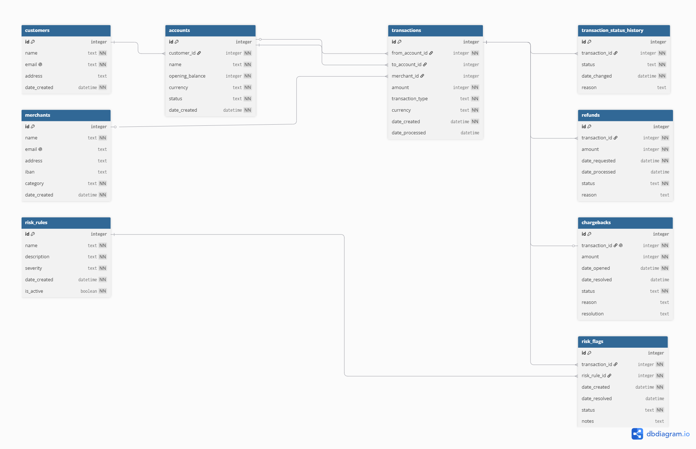

# Design Document

By Matthew Cilia

Video overview: <https://youtu.be/2NXSyKf2gng>

## Scope

The purpose of this database is to represent a simplified payment-processing system. The database tracks customers and their financial accounts, merchants that receive payments, transfers between accounts, transaction status changes, refunds, chargebacks, and transaction risk information.

The scope of the database includes:

- Customers who own financial accounts.
- Accounts used to send and receive funds.
- Merchants that accept payments.
- Payments from customer accounts to merchants.
- Transfers between customer accounts.
- The status history of transactions.
- Refund requests associated with transactions.
- Chargeback disputes associated with transactions.
- Risk rules used to classify potentially risky transactions.
- Risk flags raised against transactions.

The database does not attempt to represent a complete real-world banking or payment-processing system. Payment cards, bank authentication, exchange-rate conversion, external banking networks, user login credentials, and the actual movement of funds between financial institutions are outside the scope of this project.

The database also does not automatically detect fraudulent activity. It stores risk rules and risk flags, but the logic that evaluates a transaction against those rules would be handled outside the database.

## Functional Requirements

A user of the database should be able to:

- Create customers.
- Create financial accounts belonging to customers.
- Create merchants.
- Create risk rules.
- Record payments made from an account to a merchant.
- Record transfers between two accounts.
- Track changes to the status of a transaction.
- Request and process refunds.
- Open and resolve chargeback disputes.
- Raise, review, resolve, or dismiss risk flags.
- Activate or deactivate risk rules.
- Retrieve transactions initiated by a particular customer.
- Retrieve transactions initiated by a particular account.
- Retrieve the complete status history of a transaction.
- Retrieve refund information associated with a transaction.
- Retrieve chargeback information associated with a transaction.
- Retrieve risk flags associated with a transaction.

The database does not provide application-level functionality such as authentication, user interfaces, communication with banks, payment authorization, or automatic execution of risk rules.

The database also does not currently verify whether an account contains sufficient funds before a transaction is created.

## Representation

### Entities

The database contains nine main entities: customers, accounts, merchants, transactions, transaction status history, refunds, chargebacks, risk rules, and risk flags.

Across the database, `INTEGER` is used for primary and foreign keys because each entity can be efficiently identified using a numeric ID. `TEXT` is used for names, emails, statuses, descriptions, and other textual information. Monetary values are stored as `INTEGER` values representing minor currency units to avoid floating-point precision problems. For example, for a currency with two decimal places, `1250` represents 12.50.

`DATETIME` is used for timestamps such as creation, processing, and resolution dates. Many of these timestamps use `DEFAULT CURRENT_TIMESTAMP` so that SQLite automatically records when a record is created.

#### Customers

The `customers` table represents individuals or organizations that use the payment system and own financial accounts.

Its attributes are:

- `id` — `INTEGER`. This is the primary key and uniquely identifies each customer.
- `name` — `TEXT NOT NULL`. Every customer must have a name.
- `email` — `TEXT NOT NULL UNIQUE`. Every customer must have an email address, and the same email cannot be assigned to multiple customers.
- `address` — `TEXT`. This is optional because an address is not required for the core functionality of the database.
- `date_created` — `DATETIME NOT NULL DEFAULT CURRENT_TIMESTAMP`. This records when the customer was created automatically.

The `email` attribute also includes a `CHECK` constraint that performs basic email validation. It requires exactly one `@`, does not allow spaces, and requires text around the `@` and period. This does not perform complete email validation, but it prevents several clearly invalid formats.

#### Accounts

The `accounts` table represents financial accounts owned by customers.

Its attributes are:

- `id` — `INTEGER`. This is the primary key.
- `customer_id` — `INTEGER NOT NULL`. This is a foreign key referencing `customers.id` and identifies the owner of the account.
- `name` — `TEXT NOT NULL`. This provides a human-readable name for the account.
- `opening_balance` — `INTEGER NOT NULL`. This stores the initial balance in minor currency units.
- `currency` — `TEXT NOT NULL`. This identifies the currency used by the account.
- `status` — `TEXT NOT NULL`. This records whether the account is active, suspended, or closed.
- `date_created` — `DATETIME NOT NULL DEFAULT CURRENT_TIMESTAMP`.

A `CHECK` constraint restricts `status` to `active`, `suspended`, or `closed`. This prevents arbitrary or misspelled account states from being stored.

The combination of `customer_id` and `name` is `UNIQUE`. This means one customer cannot have two accounts with the same name, while different customers can still use the same account name.

#### Merchants

The `merchants` table represents businesses that accept customer payments.

Its attributes are:

- `id` — `INTEGER`. This is the primary key.
- `name` — `TEXT NOT NULL`. This stores the merchant's name.
- `email` — `TEXT UNIQUE`. This stores an optional merchant email address, which must be unique when provided.
- `address` — `TEXT`. This stores an optional merchant address.
- `iban` — `TEXT`. This stores an optional bank account identifier for the merchant.
- `category` — `TEXT NOT NULL`. This describes the type of business.
- `date_created` — `DATETIME NOT NULL DEFAULT CURRENT_TIMESTAMP`.

The merchant email uses the same basic validation as the customer email.

A `CHECK` constraint restricts `category` to:

- `retail`
- `groceries`
- `restaurants`
- `transport`
- `travel`
- `entertainment`
- `healthcare`
- `utilities`
- `education`
- `other`

Using a restricted list prevents inconsistent category names and makes merchant-category queries more reliable.

#### Transactions

The `transactions` table represents payments and transfers of money.

Its attributes are:

- `id` — `INTEGER`. This is the primary key.
- `from_account_id` — `INTEGER NOT NULL`. This is a foreign key referencing the account sending the money.
- `to_account_id` — `INTEGER`. This is an optional foreign key referencing the receiving account when the transaction is an account-to-account transfer.
- `merchant_id` — `INTEGER`. This is an optional foreign key referencing the receiving merchant when the transaction is a merchant payment.
- `amount` — `INTEGER NOT NULL`. This stores the transaction value in minor currency units.
- `transaction_type` — `TEXT NOT NULL`. This identifies whether the transaction is a payment or transfer.
- `currency` — `TEXT NOT NULL`. This identifies the currency used by the transaction.
- `date_created` — `DATETIME NOT NULL DEFAULT CURRENT_TIMESTAMP`.
- `date_processed` — `DATETIME`. This is nullable because a newly created transaction may not yet have been completed.

A `CHECK` constraint ensures that `amount` is greater than zero.

Another `CHECK` constraint restricts `transaction_type` to `payment` or `transfer`.

The database also enforces the destination of each transaction:

- A `payment` must reference a merchant and must not reference a destination account.
- A `transfer` must reference a destination account and must not reference a merchant.

This prevents a transaction from having no destination or two different destinations.

An additional constraint prevents `from_account_id` and `to_account_id` from being the same, preventing an account from transferring money to itself.

#### Transaction Status History

The `transaction_status_history` table records changes to the status of each transaction over time.

Its attributes are:

- `id` — `INTEGER`. This is the primary key.
- `transaction_id` — `INTEGER NOT NULL`. This is a foreign key referencing the transaction whose status changed.
- `status` — `TEXT NOT NULL DEFAULT 'pending'`.
- `date_changed` — `DATETIME NOT NULL DEFAULT CURRENT_TIMESTAMP`.
- `reason` — `TEXT`. This optionally explains why the status changed.

A `CHECK` constraint restricts `status` to:

- `pending`
- `completed`
- `declined`
- `cancelled`

A separate history table was chosen instead of storing only one status in `transactions` because it allows the database to preserve the sequence of status changes.

When a new history record has the status `completed`, a trigger automatically fills the corresponding transaction's `date_processed`. The trigger only sets the value if it has not already been populated, preserving the first completion time.

#### Refunds

The `refunds` table represents requests to return some or all of the money from an existing transaction.

Its attributes are:

- `id` — `INTEGER`. This is the primary key.
- `transaction_id` — `INTEGER NOT NULL`. This is a foreign key referencing the original transaction.
- `amount` — `INTEGER NOT NULL`. This stores the refund value in minor currency units.
- `date_requested` — `DATETIME NOT NULL DEFAULT CURRENT_TIMESTAMP`.
- `date_processed` — `DATETIME`. This remains `NULL` until the refund is successfully processed.
- `status` — `TEXT NOT NULL DEFAULT 'pending'`.
- `reason` — `TEXT`. This optionally records why the refund was requested.

A `CHECK` constraint requires the refund amount to be greater than zero.

Another `CHECK` constraint restricts the refund status to:

- `pending`
- `completed`
- `declined`
- `cancelled`

Multiple refund records may reference the same transaction, allowing partial refunds.

When the status changes to `completed`, a trigger automatically records `date_processed`.

#### Chargebacks

The `chargebacks` table represents disputes associated with completed transactions.

Its attributes are:

- `id` — `INTEGER`. This is the primary key.
- `transaction_id` — `INTEGER NOT NULL UNIQUE`. This is a foreign key referencing the disputed transaction.
- `amount` — `INTEGER NOT NULL`. This stores the disputed amount in minor currency units.
- `date_opened` — `DATETIME NOT NULL DEFAULT CURRENT_TIMESTAMP`.
- `date_resolved` — `DATETIME`. This remains `NULL` while the dispute is active.
- `status` — `TEXT NOT NULL DEFAULT 'open'`.
- `reason` — `TEXT`. This optionally explains why the dispute was opened.
- `resolution` — `TEXT`. This optionally describes the final outcome.

`transaction_id` is `UNIQUE` because this simplified design allows a maximum of one chargeback per transaction.

The amount must be greater than zero.

A `CHECK` constraint restricts `status` to:

- `open`
- `under_review`
- `won`
- `lost`
- `cancelled`

When a chargeback first reaches `won`, `lost`, or `cancelled`, a trigger automatically records `date_resolved`.

#### Risk Rules

The `risk_rules` table represents predefined rules that can be used to identify potentially risky transactions.

Its attributes are:

- `id` — `INTEGER`. This is the primary key.
- `name` — `TEXT NOT NULL`. This provides a name for the rule.
- `description` — `TEXT NOT NULL`. This explains the purpose of the rule.
- `severity` — `TEXT NOT NULL`. This identifies how significant the risk is.
- `date_created` — `DATETIME NOT NULL DEFAULT CURRENT_TIMESTAMP`.
- `is_active` — `BOOLEAN NOT NULL DEFAULT 1`. This determines whether the rule is currently active.

A `CHECK` constraint restricts `severity` to:

- `low`
- `medium`
- `high`

Although SQLite does not have a separate Boolean storage class, `is_active` is declared as `BOOLEAN` for readability and constrained to `0` or `1`. A value of `1` represents an active rule and `0` represents an inactive rule.

#### Risk Flags

The `risk_flags` table records when a transaction has been associated with a particular risk rule.

Its attributes are:

- `id` — `INTEGER`. This is the primary key.
- `transaction_id` — `INTEGER NOT NULL`. This is a foreign key referencing the flagged transaction.
- `risk_rule_id` — `INTEGER NOT NULL`. This is a foreign key referencing the rule responsible for the flag.
- `date_created` — `DATETIME NOT NULL DEFAULT CURRENT_TIMESTAMP`.
- `date_resolved` — `DATETIME`. This remains `NULL` while the flag is still active.
- `status` — `TEXT NOT NULL DEFAULT 'open'`.
- `notes` — `TEXT`. This optionally stores information about the investigation or outcome.

A `CHECK` constraint restricts `status` to:

- `open`
- `under_review`
- `resolved`
- `dismissed`

A separate `risk_flags` table is used because one transaction may trigger multiple risk rules and one risk rule may apply to multiple transactions. This allows `risk_flags` to represent the many-to-many relationship between transactions and risk rules.

When a risk flag first reaches `resolved` or `dismissed`, a trigger automatically records `date_resolved`.

### Relationships

#### ER Diagram:

The relationships between the entities are as follows:

- One customer can own many accounts, while each account belongs to one customer.
- One account can initiate many transactions, while every transaction must have one originating account.
- An account can receive many transfers.
- A merchant can receive many payments.
- A transaction can have many transaction status history records.
- A transaction can have multiple refunds.
- A transaction can have zero or one chargeback.
- A transaction can have many risk flags.
- A risk rule can be associated with many risk flags.
- Transactions and risk rules therefore form a many-to-many relationship through the `risk_flags` table.

The transaction constraints also ensure that a transaction uses the correct type of destination depending on whether it is a payment or a transfer.

## Optimizations

Several indexes were created to improve common searches and joins.

The database includes:

- `accounts_by_customer` on `accounts.customer_id`, used to find accounts belonging to a customer.
- `transactions_by_sender` on `transactions.from_account_id`, used to find transactions initiated by an account.
- `transactions_by_receiver` on `transactions.to_accovunt_id`, used to find transfers received by an account.
- `transactions_by_merchant` on `transactions.merchant_id`, used to find payments associated with a merchant.
- `status_history_by_transaction_date` on `transaction_status_history(transaction_id, date_changed)`, used to retrieve the history of a transaction in chronological order.
- `refunds_by_transaction` on `refunds.transaction_id`, used to find refunds belonging to a transaction.
- `risk_flags_by_transaction` on `risk_flags.transaction_id`, used to find all flags associated with a transaction.
- `risk_flags_by_rule` on `risk_flags.risk_rule_id`, used to find flags created from a particular rule.

A view named `transaction_details` is also used to combine transaction information with the initiating account name and the email address of the customer who owns that account.

This makes common transaction searches simpler because the `transactions`, `accounts`, and `customers` tables do not need to be joined manually each time.

## Limitations

The database is intentionally a simplified representation of a payment-processing system and has several limitations.

The system stores currency codes but does not perform currency conversion or maintain exchange rates. It therefore cannot safely combine monetary values from different currencies without external logic.

The database stores an account's opening balance but does not maintain a continuously updated current balance. Determining the current balance would require applying completed payments, transfers, and refunds to the opening balance.

Risk rules are stored as definitions, but the database does not contain logic that automatically evaluates transactions against those rules. Risk flags must therefore be created manually or by external application logic.

Transaction statuses have a full history, but refunds, chargebacks, and risk flags only store their current status together with relevant timestamps. Their previous status changes cannot be reconstructed.

The database does not enforce that a transaction must already be completed before a refund is requested.

It also does not ensure that the combined value of multiple refunds is less than or equal to the original transaction amount.

The database allows only one chargeback per transaction, which simplifies the model but may not represent all real-world payment dispute processes.

The database does not enforce every possible valid status transition. Application logic would be required to prevent transitions that do not make sense.

Finally, the database does not represent payment cards, user authentication, external bank settlement, payment gateways, exchange rates, taxation, regulatory compliance, or other infrastructure required by a real payment-processing platform.
